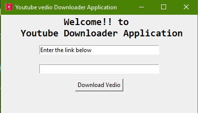

# YOUTUBE VEDIO DOWNLOPADER

## steps to start with project

1. Install  virtualenv 
    `pip install virtualenv`
2. Create virtual_env  
    `virtualenv <env_name>`  
    `ex- virtualenv v_env`
3. Install requirement.txt
    `pip install -r requirement.txt`